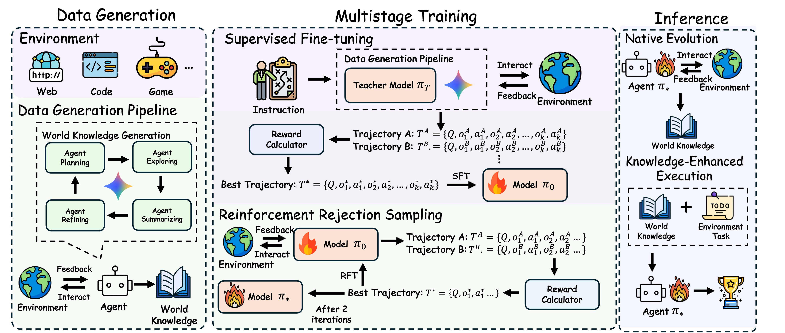

# World Knowledge
<p align="center">
  <strong>📝 Paper: <em>Training LLM Agents for Spontaneous, Reward-Free Self-Evolution via World Knowledge Exploration</em></strong>
  &nbsp;|&nbsp;
  <a href="(https://arxiv.org/abs/2604.18131)" target="_blank" rel="noopener noreferrer">arXiv</a>
</p>

<p align="center">




</p>


This is a web-agent pipeline for constructing reusable environment-specific knowledge and using it to improve downstream web task execution.

In the terminology of the paper, the core artifact is **World Knowledge (K)**: a compact, structured representation of a specific environment instance. In this repository, that artifact is stored as Markdown and is historically referred to in some scripts as a `notebook` or `guidebook`. These terms refer to the same object.

## Overview

This repository implements the web-environment pipeline behind the paper. The central idea is to split agent behavior into two phases:

1. **Native Evolution Phase**: the agent explores a previously unseen website and compresses its observations into World Knowledge.
2. **Knowledge-Enhanced Execution Phase**: the agent solves downstream tasks with that World Knowledge provided as external context.

At a high level, the workflow is:

```text
Target website URLs
    ->
URL crawl / clustering
    ->
World Knowledge prompt generation
    ->
World Knowledge generation
    ->
Test set construction
    ->
CK-pro inference
    ->
LLM-based judging
    ->
Accuracy / efficiency analysis
```

World Knowledge is intended to be:

- **compact** enough to fit into the agent context window,
- **structured** around website regions and URL prefixes,
- **actionable** for navigation and question answering,
- **environment-specific**, functioning as a mental map of one concrete website.

World Knowledge improves both downstream effectiveness and efficiency: large absolute gains on WebWalker and WebVoyager, fewer execution steps, and cross-model transferability.

## Setup

### 1. Environment

The current installation notes live in `requirement.sh`. In practice, the project expects:

- Python 3.12
- `openai`, `jsonlines`, `transformers`, `matplotlib`, and related Python packages
- browser / scraping dependencies for CK web agents
- Node.js and npm
- Playwright/browser runtime dependencies
- one or more vLLM-compatible inference endpoints

You also need to replace placeholder values in the shell scripts, such as:

- `PYTHONPATH`
- `BROWSERLESS_TARGET_HOST`
- `BROWSERLESS_TOKEN`
- `HF_TOKEN`
- hard-coded `/path/to/...` values

### 2. Web servers

The web agent depends on a pool of web servers:

```bash
bash run_web_server.sh
```

### 3. Inference endpoints

The pipeline assumes accessible inference backends, with the current scripts defaulting to ports such as `8080-8083`.

## Evaluation

Evaluation in this repository follows the paper's World-Knowledge-enhanced web-agent setting.

### Input preparation

#### Step 1: Crawl URLs

Start from one or more seed websites:

```bash
python preprocess/crawl_urls.py preprocess/urls.txt
```

This produces same-domain URL lists.

#### Step 2: Cluster URLs

Convert crawled URLs into the clustered website representation used for World Knowledge generation:

```bash
python preprocess/cluster_urls.py data/conference/
```

This matches the paper's input-processing design: websites are transformed into clustered, structured representations before World Knowledge generation.

### Run the pipeline

Three main entry scripts are provided:

| Script | Purpose |
| --- | --- |
| `data_pipeline_train.sh` | Full pipeline: World Knowledge prompt generation, World Knowledge generation, test data construction, CK-pro inference, judging, and analysis. |
| `data_pipeline_train_gen_only.sh` | Generation-only pipeline: World Knowledge prompt generation, World Knowledge generation, and test data construction. |
| `data_pipeline_train_test_only.sh` | Test-only pipeline: test data construction, CK-pro inference, judging, and analysis. Assumes World Knowledge Markdown files already exist. |

All three scripts support two input modes:

- `MODE=urls`: use the hard-coded `urls=(...)` array inside the script.
- `MODE=domain`: scan `data/${domain}/*_clusters.txt` and automatically collect all URLs for that domain.

### Full pipeline

```bash
MODE=urls bash data_pipeline_train.sh 5
```

or

```bash
MODE=domain bash data_pipeline_train.sh 5
```

### World Knowledge generation only

```bash
MODE=urls bash data_pipeline_train_gen_only.sh 5
```

or

```bash
MODE=domain bash data_pipeline_train_gen_only.sh 5
```

### Test + judge only

Use this when World Knowledge Markdown files already exist:

```bash
MODE=urls bash data_pipeline_train_test_only.sh 5
```

or

```bash
MODE=domain bash data_pipeline_train_test_only.sh 5
```

### Analysis scripts

The main evaluation utilities are:

| File | Purpose |
| --- | --- |
| `test_accuracy.py` | Uses an LLM judge to score correctness and writes judged outputs. |
| `test_efficency.py` | Computes average step counts, including sub-agent steps. |
| `calculate_effectiveness.py` | Aggregates judged outputs and plots accuracy across settings. |

These correspond to the two major metrics emphasized in the paper:

- **effectiveness**: downstream task success rate,
- **efficiency**: number of execution steps.

## Repository Structure

```text
world-knowledge/
├── data/
│   └── conference/
├── preprocess/
│   ├── crawl_urls.py
│   ├── cluster_urls.py
│   └── urls.txt
├── questions/
│   └── notebook_prompt/
├── queue_file/
├── test_data/
├── output_note/
├── output_ans/
├── results/
├── pipeline_log/
├── System/
├── Evaluation/
├── dpo/
├── notebook_prompt.py
├── notebook_prompt_short.py
├── problem_generation_with_notebook.py
├── test_accuracy.py
├── test_efficency.py
├── calculate_effectiveness.py
├── data_pipeline_train.sh
├── data_pipeline_train_gen_only.sh
├── data_pipeline_train_test_only.sh
├── run_web_server.sh
└── requirement.sh
```

## Citation

If you use this repository, please cite the accompanying World Knowledge paper.
